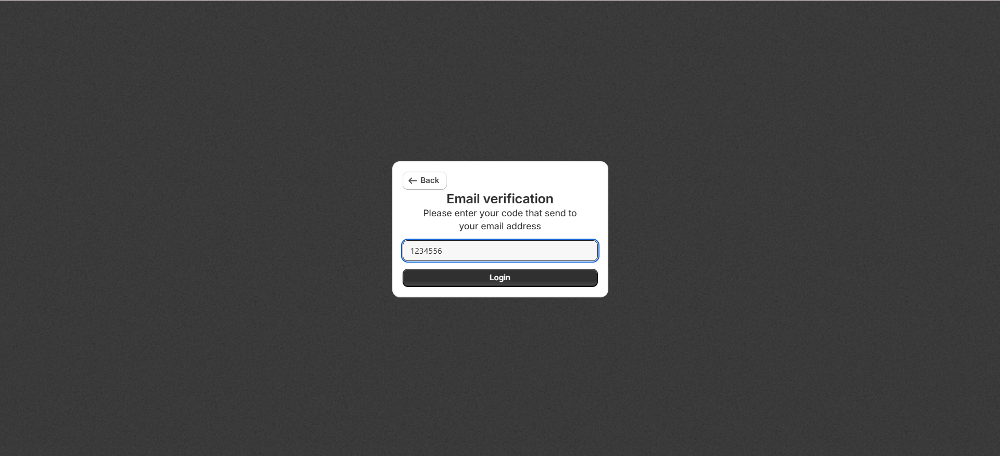
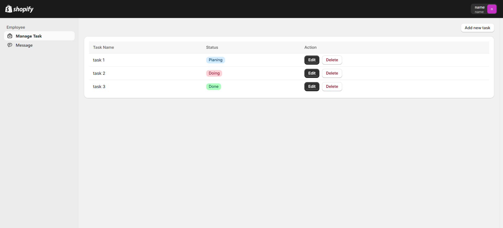
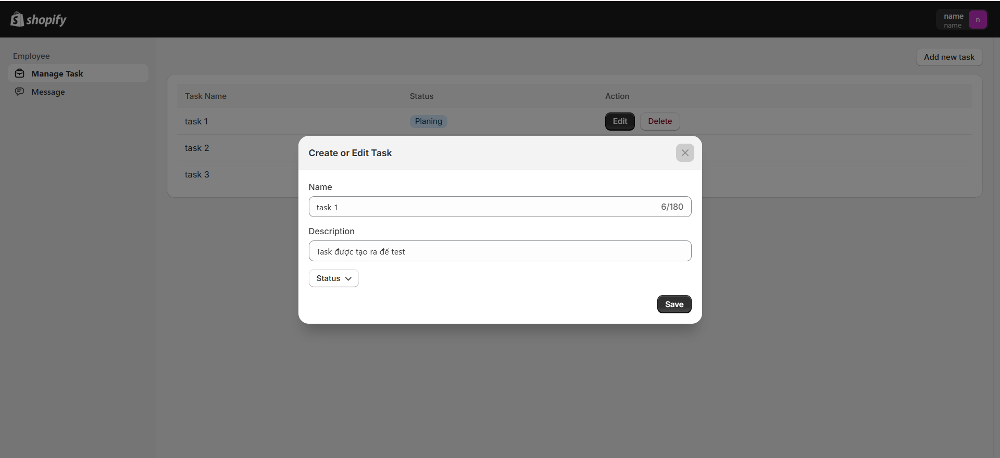
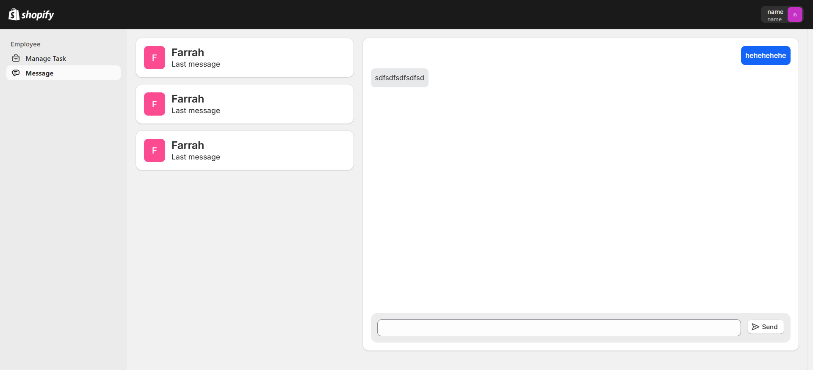
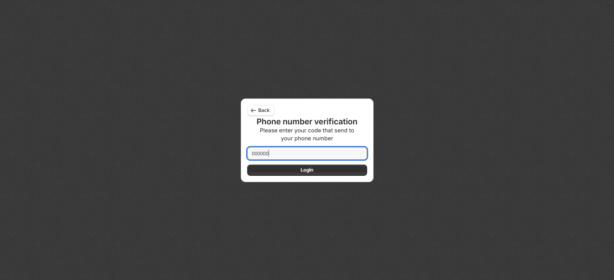
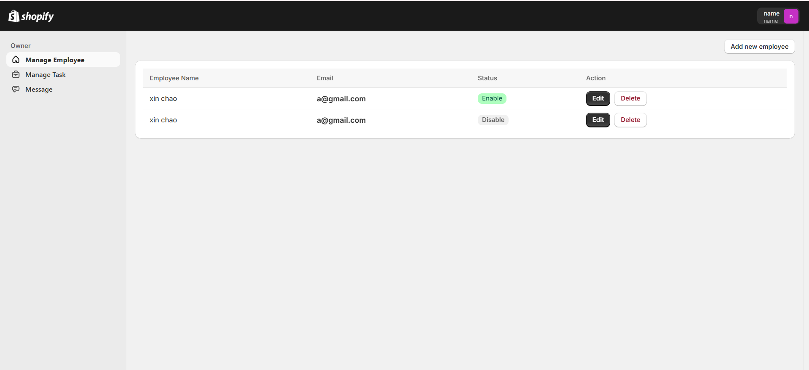
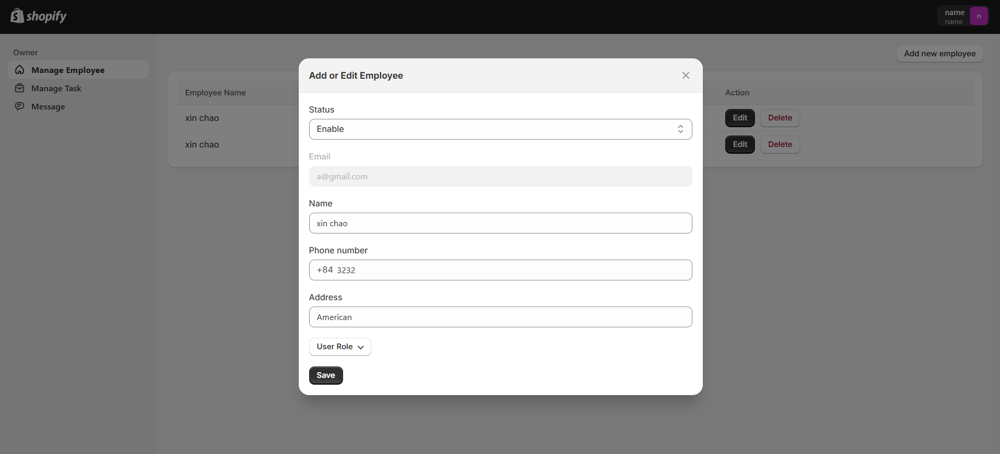
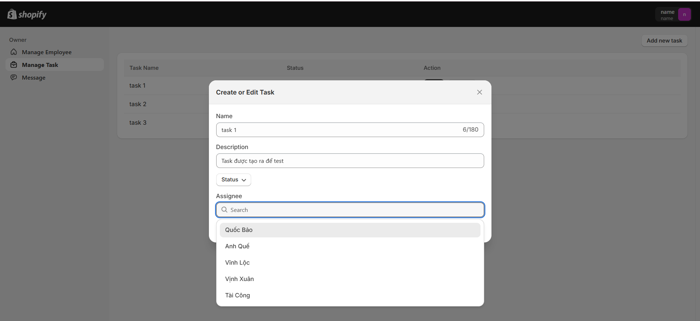
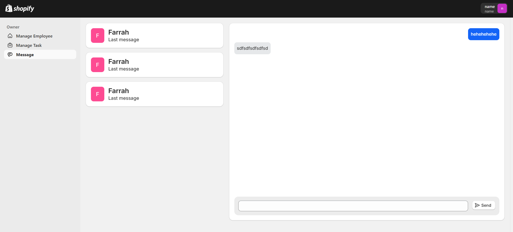

# Frontend: Nextjs vs Typescript vs Shopify polaris (UI)

# Employee functions
## auth step 1

## auth step 2

## task manage

## form edit

## message 

# Owner functions
## auth step 1

## auth step 2

## Manage employee

## Edit employee

## Tasks

## Edit task

## Message 

# Backend: ExpressJs